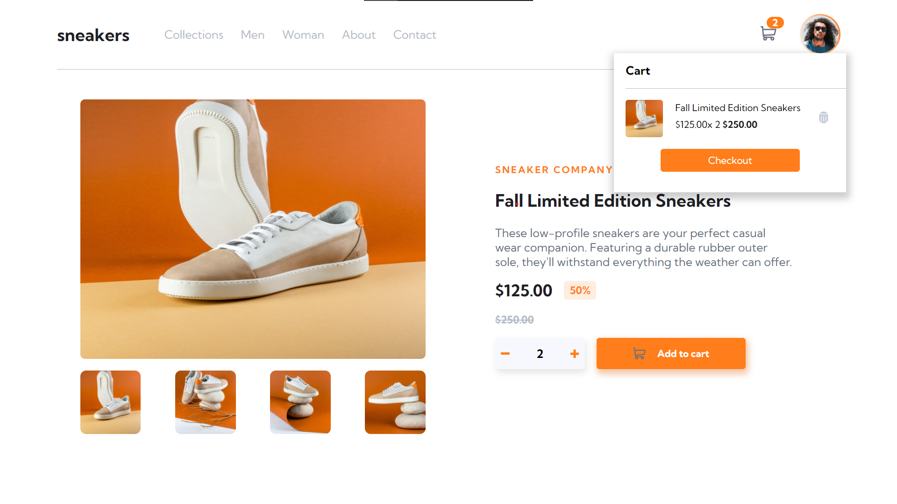
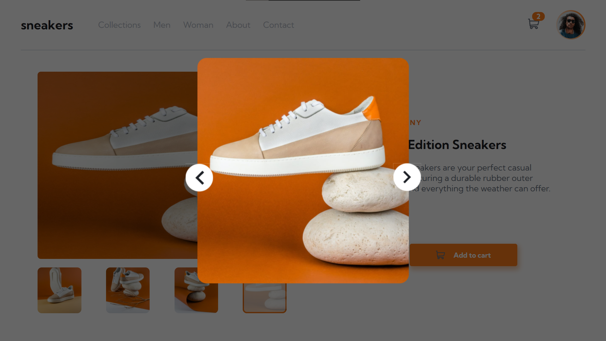

<h1 align="center">E-commerce one page</h1>

<h2 align="center">Desafio Front End Mentor</h2>

  <a href="#-Project">Projeto</a>&nbsp;&nbsp;&nbsp;|&nbsp;&nbsp;&nbsp;
  <a href="#hammer_and_wrench-Features">Features</a>&nbsp;&nbsp;&nbsp;|&nbsp;&nbsp;&nbsp;
  <a href="#-Technologies">Tecnologias</a>&nbsp;&nbsp;&nbsp;|&nbsp;&nbsp;&nbsp;
  <a href="#-How-to-execute">Como usar</a>&nbsp;&nbsp;&nbsp;|&nbsp;&nbsp;&nbsp;
  <a href="#-Licence">Licença</a>

  

##

  

<!-- <video src="./src/assets/App.mp4" width="100%" autoplay></video> -->

## 💻 Projeto

E-commerce é um página de produto de comércio eletrônico. Este desafio foi desenvolvido em ReactJS e foi idealizado pelo site [FrontEndMentor](https://www.frontendmentor.io/).

## :hammer_and_wrench: Features

- [x] Adicionar itens ao carrinho
- [x] Visualizar o carrinho e remover ele
- [x] Mudar a imagem grande do produto clicando na miniatura
- [x] Abrir uma galeria lightbox ao clicar na imagem principal

## ✨ Tecnologias

Este projeto foi desenvolvido com as tecnologias abaixo:

- [ReactJS](https://reactjs.org)
- [Styled Components](https://styled-components.com)
- [ContextAPI](https://pt-br.reactjs.org/docs/context.html)
<!-- - [JSON Server](https://github.com/typicode/json-server)
- [Axios](https://axios-http.com) -->

## 🚀 Como executar o projeto

- Clone o repositório
- Instale as dependências com `yarn`
- Execute a aplicação com `yarn start`
- Acesse [`localhost:3000`](http://localhost:3000) no seu navegador
<!-- - Execute o comando `yarn server` -->

## 📄 Licença

Este projeto está sob a licença MIT abaixo. Leia sobre [LICENSE](./LICENSE) para mais informações.

---
Veja aplicação [online](https://ecommerce-one-page.netlify.app/)

Desenvolvido por Samael Melo .
